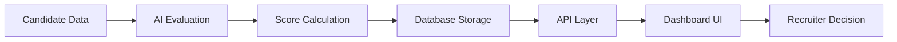

# recycling-manager-dashboard

<div align="center">

# ♻️ Recycling Manager Dashboard

### AI-Powered Candidate Evaluation System

*Optimizing environmental impact through strategic workforce management*

[](https://reactjs.org/)
[](https://vitejs.dev/)
[](https://mantine.dev/)
[](https://nodejs.org/)
[](https://www.mysql.com/)

</div>

---

## 📊 Dashboard Overview

<div align="center">

### Comprehensive Analytics & Rankings


*Real-time candidate evaluation with AI-powered scoring across Crisis Management, Sustainability, and Team Motivation*

</div>

### 🎯 Key Metrics at a Glance

- **40 Total Candidates** evaluated
- **79** Average Crisis Management Score
- **79** Average Sustainability Score  
- **82** Average Team Motivation Score

---

## 👥 Candidate Insights

<div align="center">

### Individual Performance Profiles

  # recycling-manager-dashboard <div align="center">

*Detailed breakdown of each candidate's strengths across core competencies*

</div>

---

## 🔥 Skill Distribution

<div align="center">

### Team Composition Analysis


*Visual heatmap showing skill distribution across top candidates*

</div>

---

## ✨ Features

<table>
<tr>
<td width="50%">

### 🏆 Smart Rankings
- Top 10 candidates leaderboard
- Real-time score updates
- Multi-factor evaluation system

</td>
<td width="50%">

### 📈 Data Visualization
- Interactive skill comparisons
- Performance metrics
- Team cohesion analysis

</td>
</tr>
<tr>
<td width="50%">

### 👤 Candidate Profiles
- Detailed skill breakdowns
- Experience tracking
- Shareable profile cards

</td>
<td width="50%">

### 🤖 AI-Powered Scoring
- Standardized evaluation prompts
- Automated calculations
- Bias-free assessments

</td>
</tr>
</table>

---

## 🗂️ Project Structure

```
recycling-manager-dashboard/
│
├── 🎨 frontend/              # React + Vite dashboard
│   ├── src/
│   │   ├── components/       # Reusable UI components
│   │   ├── pages/           # Dashboard pages
│   │   └── styles/          # Global styles
│   └── package.json
│
├── ⚙️ backend/               # Node.js + Express API
│   ├── routes/              # API endpoints
│   ├── controllers/         # Business logic
│   └── server.js
│
├── 🗄️ database/
│   ├── schema.sql           # Tables, triggers, stored procedures
│   └── sample_data.sql      # 40 sample candidates with AI scores
│
├── 🤖 ai_prompts/
│   └── ai_prompts.md        # Standardized evaluation prompts
│
└── 📸 screenshots/           # Dashboard previews
```

---

## 🚀 Quick Start

### Prerequisites

```bash
node >= 18.0.0
npm >= 9.0.0
mysql >= 8.0
```

### 1️⃣ Database Setup

```sql
# Start MySQL and create database
mysql -u root -p

CREATE DATABASE recycling_dashboard;
USE recycling_dashboard;

# Import schema and sample data
SOURCE database/schema.sql;
SOURCE database/sample_data.sql;
```

### 2️⃣ Backend Setup

```bash
cd backend
npm install
node server.js
```

✅ Backend running at `http://localhost:5000`

### 3️⃣ Frontend Setup

```bash
cd frontend
npm install
npm run dev
```

✅ Dashboard live at `http://localhost:5173`

---

## 🔌 API Endpoints

| Endpoint | Method | Description |
|----------|--------|-------------|
| `/api/top10` | GET | Top 10 ranked candidates |
| `/api/candidates` | GET | All candidates with detailed scores |
| `/api/candidates/:id` | GET | Individual candidate profile |
| `/api/metrics` | GET | Dashboard summary statistics |

---

## 🎯 How It Works



1. **Data Collection** – Candidate information stored in MySQL
2. **AI Evaluation** – Standardized prompts generate objective scores
3. **Automated Ranking** – Database triggers calculate composite scores
4. **Real-time Visualization** – React dashboard displays insights
5. **Decision Support** – Recruiters make informed hiring choices

---

## 🤖 AI Evaluation System

The system uses structured prompts to evaluate candidates across three key dimensions:

| Dimension | Weight | Description |
|-----------|--------|-------------|
| **Crisis Management** | 33% | Ability to handle emergencies and production issues |
| **Sustainability** | 33% | Environmental impact awareness and circular economy knowledge |
| **Team Motivation** | 34% | Leadership and team building capabilities |

> 📝 Full evaluation prompts available in [`ai_prompts/ai_prompts.md`](ai_prompts/ai_prompts.md)

---

## 🎨 UI/UX Highlights

<table>
<tr>
<td>

### 🎯 Design Principles
- **Minimal & Clean** – Focus on data clarity
- **Information Hierarchy** – Critical metrics front and center
- **Visual Feedback** – Color-coded performance indicators
- **Responsive Layout** – Works on all screen sizes

</td>
<td>

### 🌈 Color System
- 🟢 **Green (80-100)** – Excellent performance
- 🟠 **Orange (60-79)** – Moderate performance  
- 🔴 **Red (<60)** – Needs improvement
- 🔵 **Blue** – Neutral/informational

</td>
</tr>
</table>

---

## 🛠️ Tech Stack

<div align="center">

| Layer | Technologies |
|-------|-------------|
| **Frontend** | React 18, Vite 5, Mantine UI, Recharts |
| **Backend** | Node.js, Express, CORS |
| **Database** | MySQL 8, Stored Procedures, Triggers |
| **AI Logic** | Prompt Engineering, Structured Evaluation |
| **Development** | ESLint, Prettier, Git |

</div>

---

## 📈 Performance Metrics

- **Average Experience**: 8.3 years
- **Skill Balance**: 79/79/82 (Crisis/Sustainability/Motivation)
- **Team Cohesion**: High
- **Total Candidate Pool**: 40 professionals

---

## 🤝 Contributing

We welcome contributions! Please follow these steps:

1. Fork the repository
2. Create a feature branch (`git checkout -b feature/AmazingFeature`)
3. Commit changes (`git commit -m 'Add AmazingFeature'`)
4. Push to branch (`git push origin feature/AmazingFeature`)
5. Open a Pull Request

---

## 📄 License

This project is licensed under the MIT License - see the [LICENSE](LICENSE) file for details.

---

## 🙏 Acknowledgments

- Built with ❤️ for sustainable workforce management
- Powered by AI-driven insights
- Designed for recruiter efficiency

---

<div align="center">

### 🌍 Making Recycling Management Smarter

**[View Demo](https://github.com/tarunmehrda/recycling-manager-dashboard)** • **[Report Bug](https://github.com/tarunmehrda/recycling-manager-dashboard/issues)** • **[Request Feature](https://github.com/tarunmehrda/recycling-manager-dashboard/issues)**

Made with 💚 for a sustainable future

</div>

